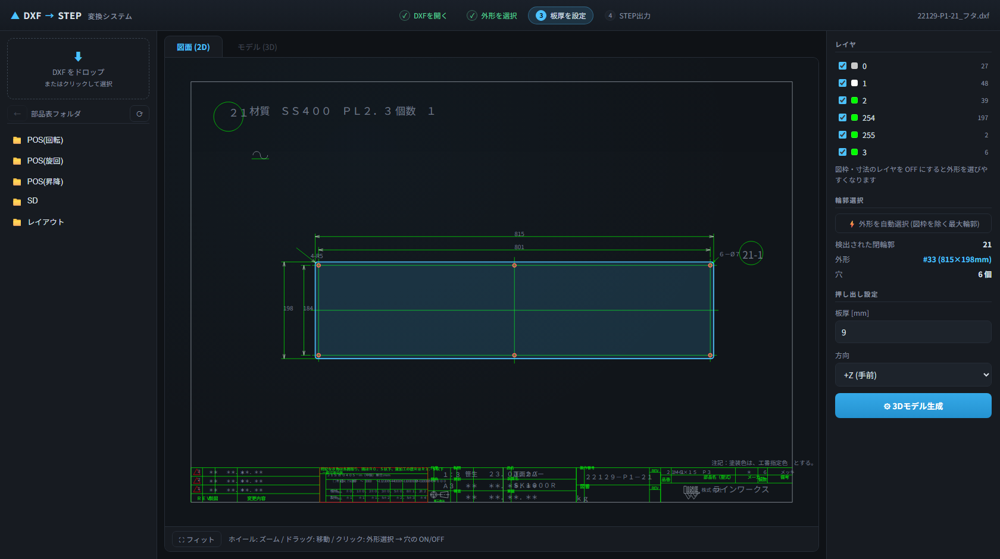
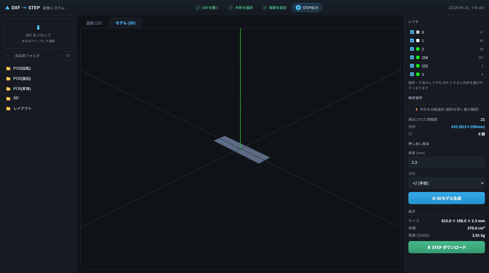

# DXF → STEP 変換システム (3D-CAD-Operator)

2D の DXF 図面(部品図)を読み込み、対話的に 3D 化して **STEP (ISO-10303-21)** を出力する社内向け Web システムです。




## 特徴

- **閉輪郭の自動検出** — 線分・円弧を端点で連結して平面グラフを構築し、部品の外形・穴を自動抽出。中心線や寸法線の食み出しはダングリングエッジ除去で自動的に無視されます
- **外形の自動選択** — 図枠(図面全体とほぼ同サイズの輪郭)を除いた最大輪郭を自動で外形として選択。穴も自動検出(クリックで個別 ON/OFF 可)
- **板厚の自動提案** — 表題欄・注記の「ＰＬ２.３」「t=9」「板厚12」等の表記(全角対応)から板厚を自動検出してセット
- **厳密な形状変換** — 円弧・円は折れ線近似ではなく厳密な幾何プリミティブとして OpenCascade カーネル(build123d)に渡すため、製造用途に耐える STEP を出力
- **こだわりの UI** — 図面レンダリング付き 2D ビューア(パン/ズーム/レイヤ切替/輪郭クリック選択)、Three.js による 3D プレビュー、進行ステップ表示、質量自動計算(SS400)
- **ワンクリック変換** — `http://<host>:8000/?open=<パス>&build=1` で開く→外形自動選択→板厚自動検出→3D 生成まで全自動

## 構成

```
backend/   FastAPI + ezdxf (DXF解析) + build123d (OpenCascade / STEP・GLB出力)
frontend/  React + TypeScript + Vite + Three.js
```

| 処理 | 実装 |
|---|---|
| DXF 解析 (AC1015 / Shift-JIS 対応) | `backend/app/dxf_parser.py` |
| 閉輪郭検出 (平面グラフ面抽出) | `backend/app/contours.py` |
| 3D モデリング / STEP・GLB 出力 | `backend/app/modeler.py` |
| API サーバ | `backend/app/main.py` |

## セットアップ

必要環境: **Python 3.12+ / Node.js 20+ / Windows・Linux・macOS**

```bash
# 1. バックエンド
cd backend
pip install -r requirements.txt

# 2. フロントエンド (ビルドして FastAPI から配信)
cd ../frontend
npm install
npm run build

# 3. 起動
cd ../backend
set DXF_ROOT=C:\path\to\DXFデータ 部品表用   # 社内 DXF フォルダ (省略可)
python -m uvicorn app.main:app --host 0.0.0.0 --port 8000
```

ブラウザで `http://localhost:8000/` を開きます。社内共有する場合はこの PC の IP アドレス(例 `http://192.168.x.x:8000/`)にアクセスしてもらうだけです。

### 開発モード (ホットリロード)

```bash
# ターミナル 1
cd backend && python -m uvicorn app.main:app --reload
# ターミナル 2
cd frontend && npm run dev    # http://localhost:5173 (API は 8000 へプロキシ)
```

## 使い方

1. **DXF を開く** — 左パネルのフォルダから選択、またはファイルをドラッグ&ドロップ
2. **外形を確認** — 開くと同時に外形・穴・板厚が自動推定されます。違う場合は 2D ビューア上で輪郭をクリックして外形を選び直し(穴はクリックで ON/OFF)。図枠・寸法レイヤを OFF にすると選びやすくなります
3. **板厚・方向を設定** — 押し出し方向は +Z / -Z / 両側均等
4. **「3D モデル生成」→「STEP ダウンロード」** — 3D プレビューで確認し、STEP を保存

## 対応範囲と制限

- 対象は **一定板厚の押し出し形状**(プレート・フタ・フランジ・ブラケット等)。板金・機械加工部品の大半をカバーします
- 旋盤加工品(シャフト等)の回転体化、多段押し出しは今後の拡張課題
- LINE / ARC / CIRCLE / LWPOLYLINE / POLYLINE(バルジ対応)/ ELLIPSE / SPLINE(折れ線近似)/ INSERT(ブロック展開)に対応
- 実図面 121 ファイルで解析・輪郭検出の動作検証済み

## API

| エンドポイント | 内容 |
|---|---|
| `GET /api/browse?path=` | DXF_ROOT 配下のフォルダ/ファイル一覧 |
| `POST /api/open` `{path}` | サーバ上の DXF を解析 |
| `POST /api/upload` (multipart) | アップロードした DXF を解析 |
| `POST /api/contours` `{session, layers}` | 指定レイヤで閉輪郭を検出 |
| `POST /api/model` `{session, outer, holes, thickness, mode}` | ソリッド生成 → STEP/GLB |
| `GET /api/file/{session}/{name}` | 生成ファイルのダウンロード |
